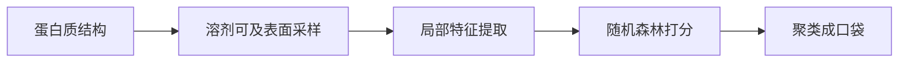
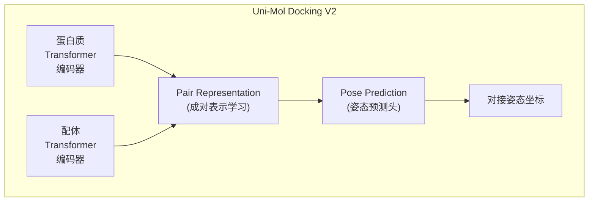
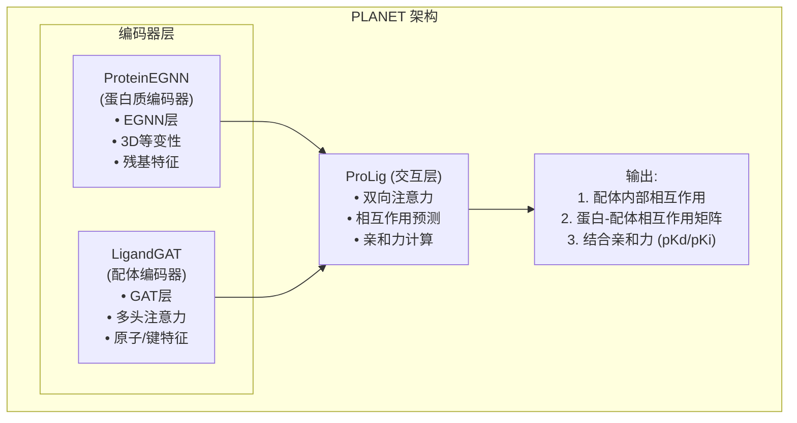
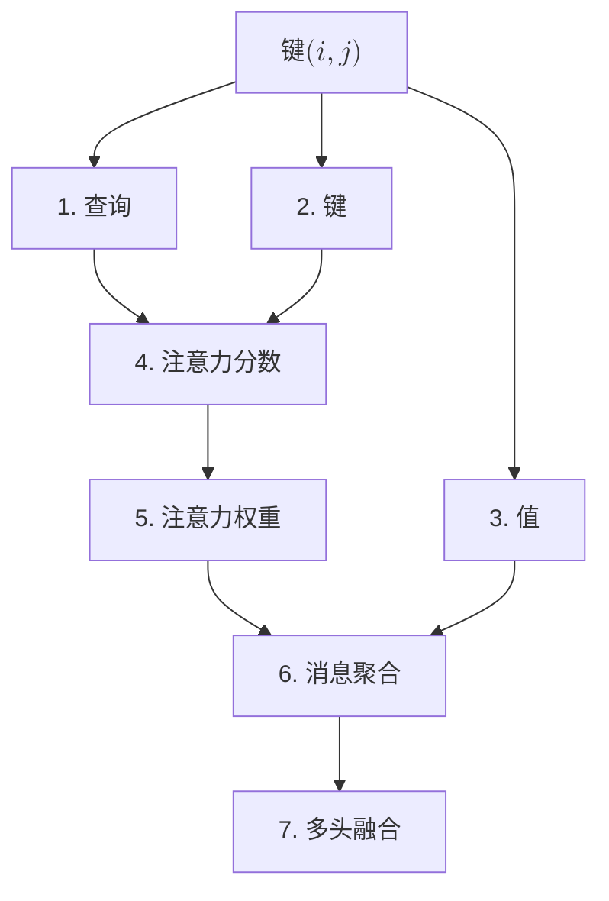
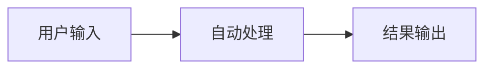

# Flash_Dock 项目架构与技术分析

## 目录

- [项目概览](#项目概览)

- [整体架构](#整体架构)

- [后端算法与模型层详细分析](#后端算法与模型层详细分析)

- [前端技术栈](#前端技术栈)

- [数据流与文件结构](#数据流与文件结构)

- [技术亮点](#技术亮点)

---

## 项目概览

Flash_Dock 是一个基于 **Streamlit** 的交互式 Web 应用，用于整合小分子配体的准备、蛋白口袋预测、分子对接和结合亲和力评估等流程，面向药物发现场景。

### 核心功能

- **配体准备**：分子绘制、SMILES输入、3D构象生成与优化

- **口袋预测**：基于机器学习的蛋白质配体结合位点预测

- **分子对接**：深度学习驱动的高精度蛋白-配体对接

- **亲和力预测**：图神经网络预测结合亲和力

- **批量处理**：支持多蛋白多配体的批量对接与亲和力评估

---

## 整体架构

### 技术栈总览

```
┌─────────────────────────────────────────────────────────────┐
│                    前端交互层 (Streamlit)                          
│  ┌──────────┬──────────┬──────────┬──────────┬──────────┐   
│  │  主页        配体准备     口袋预测    分子对接     亲和力       
│  └──────────┴──────────┴──────────┴──────────┴──────────┘   
└─────────────────────────────────────────────────────────────┘
                              ↓
┌─────────────────────────────────────────────────────────────┐
│                    可视化层                                    
│  • streamlit-molstar (Mol* 3D渲染)                           
│  • streamlit-ketcher (2D分子绘图)                            
│  • py3Dmol + stmol (3D分子可视化)                            
│  • matplotlib + seaborn (数据可视化)                         
└─────────────────────────────────────────────────────────────┘
                              ↓
┌─────────────────────────────────────────────────────────────┐
│                    算法与模型层                                
│  ┌─────────────┬─────────────┬─────────────┬─────────────┐ 
│  │    RDKit           P2Rank        Uni-Mol         PLANET    
│  │  (配体准备)    |  (口袋预测)  |    (对接)     |   (亲和力)
│  │   传统算法         机器学习       深度学习         深度学习    
│  └─────────────┴─────────────┴─────────────┴─────────────┘ 
└─────────────────────────────────────────────────────────────┘
```

### 数据流管线

```
用户输入 → RDKit → 3D配体SDF
                      ↓
蛋白质PDB → P2Rank → 口袋中心坐标 (x,y,z)
                      ↓
SDF + PDB + 坐标 → Uni-Mol → 对接姿态SDF
                                ↓
对接姿态SDF + PDB → PLANET → 结合亲和力 (pKd)
```

---

## 后端算法与模型层详细分析

### 1. 配体准备模块 (RDKit)

#### 技术栈

- **RDKit**：开源化学信息学库

- **MMFF力场**：Merck分子力场优化算法

- **ETKDG算法**：实验扭转角知识距离几何算法

#### 核心流程

```python
# 3D构象生成与优化
mol_3d = Chem.AddHs(mol)                    # 1. 添加氢原子
AllChem.EmbedMolecule(mol_3d, AllChem.ETKDG())  # 2. 3D嵌入
AllChem.MMFFOptimizeMolecule(mol_3d)        # 3. 能量最小化
```

#### 算法步骤

1. **加氢处理** (`Chem.AddHs`)

   - 添加隐式氢原子

   - 确保化学计量正确性

   - 为后续3D构象生成提供完整原子信息

2. **3D嵌入** (`AllChem.ETKDG`)

   - 使用距离几何算法生成初始3D坐标

   - 结合实验扭转角数据库约束

   - 生成化学合理的初始构象

3. **MMFF优化**

   - Merck分子力场能量最小化

   - 优化键长、键角、二面角

   - 获得能量稳定构象

#### 输入输出

- **输入**：SMILES字符串或2D SDF文件

- **输出**：3D优化后的SDF文件（含氢原子）

---

### 2. 口袋预测模块 (P2Rank)

#### 技术栈

- **P2Rank 2.5**：基于机器学习的配体结合位点预测工具

- **Java运行环境**：跨平台执行

- **随机森林模型**：核心预测算法

#### 算法原理

P2Rank采用**基于表面采样的机器学习方法**：



##### 详细步骤

1. **表面采样**

   - 在蛋白质溶剂可及表面（SAS）生成采样点

   - 采样密度可配置（默认约每Ų一个点）

2. **特征提取**（每个采样点）

   - **几何特征**：曲率、深度、表面积

   - **化学特征**：疏水性、电荷分布、氢键供体/受体

   - **序列特征**：邻近残基类型、保守性

   - **结构特征**：B-factor、二级结构

3. **机器学习打分**

   - 使用预训练的随机森林模型

   - 输出每个点的"配体结合能力"分数（0-1）

   - 模型在已知蛋白-配体复合物数据集上训练

4. **聚类与排序**

   - 将高分点（通常>0.5）聚类形成候选口袋

   - 按概率排序输出Top-N口袋

   - 计算每个口袋的中心坐标和邻近残基

#### 性能指标

- **成功率**：在标准基准上Top-1预测成功率约60-70%

- **速度**：单个蛋白预测约1-5秒（取决于蛋白大小）

- **优势**：

  - 无需配体信息（从头预测）

  - 支持AlphaFold模型（不依赖B-factor特征）

  - 高召回率（通常能找到真实口袋）

#### 输出格式

```csv
Pocket Name, Center, Rank, Score, Probability, Residues
protein.pdb, [x, y, z], 1, 15.3, 0.87, "ALA_123, TYR_145, ..."
```

#### 配置选项

- **默认模型**：适用于X-ray晶体结构

- **AlphaFold模型**：`-c alphafold`，不使用B-factor特征

- **保守性模型**：`-c conservation_hmm`，结合序列保守性

---

### 3. 分子对接模块 (Uni-Mol Docking V2)

#### 技术栈

- **Uni-Mol**：基于Transformer的深度学习分子对接框架

- **Uni-Core**：分布式训练框架

- **PyTorch**：深度学习后端

- **模型权重**：`unimol_docking_v2_240517.pt` (464MB)

#### 算法架构

Uni-Mol采用**端到端深度学习**范式，核心是**双塔Transformer编码器**：



##### 关键技术

1. **分子表示学习**

   - 蛋白质：残基级别的序列+结构编码

   - 配体：原子级别的图表示+3D坐标

   - 使用预训练的Uni-Mol权重初始化

2. **成对交互建模**

   - Transformer层建模蛋白-配体原子对之间的相互作用

   - 注意力机制捕捉长程依赖

   - 学习氢键、疏水作用、π-π堆积等模式

3. **构象采样与聚类**

   - 生成多个候选姿态（`--conf-size 10`）

   - 基于RMSD聚类去重（`--cluster`）

   - 输出Top-1姿态作为最终预测

4. **立体冲突修正**

   - 后处理步骤修正原子重叠

   - 保持手性中心正确性

   - 确保化学合理性（`--steric-clash-fix`）

#### 推理流程

```bash
python demo.py \
  --mode single \
  --conf-size 10 \              # 生成10个候选构象
  --cluster \                   # 对预测姿态聚类
  --input-protein protein.pdb \
  --input-ligand ligand.sdf \
  --input-docking-grid grid.json \  # 口袋中心+尺寸
  --output-ligand-name result \
  --output-ligand-dir ./output \
  --steric-clash-fix \          # 修正立体冲突
  --model-dir unimol_docking_v2_240517.pt
```

#### 性能突破

在**PoseBusters基准**（428个蛋白-配体复合物）上的表现：

| 方法 | <2Å RMSD (%) | 通过质量检查 (%) |
|------|--------------|------------------|
| DeepDock | 17.8 | - |
| DiffDock | 37.9 | - |
| AutoDock Vina | 52.3 | - |
| Uni-Mol Docking V1 | 62.4 | - |
| AlphaFold Latest | 73.6 | - |
| **Uni-Mol Docking V2** | **77.6** | **75+** |

在**Astex基准**（85个复合物）上：

- Uni-Mol Docking V2：**95.29%** (<2Å RMSD)

- 接近实验精度水平

#### 技术优势

1. **高精度**：超越传统方法20-30个百分点

2. **化学准确性**：避免手性翻转、原子重叠等问题

3. **速度快**：单个对接任务约10-30秒（GPU）

4. **端到端**：无需手工特征工程

---

### 4. 亲和力预测模块 (PLANET)

#### 技术栈

- **PyTorch**：深度学习框架

- **图神经网络 (GNN)**：处理分子与蛋白质图结构

- **注意力机制**：建模蛋白-配体相互作用

- **多任务学习**：联合预测相互作用与亲和力

#### 模型架构

PLANET采用**三层神经网络结构**：



#### 详细组件分析

##### (1) ProteinEGNN - 蛋白质编码器

**核心技术**：E(3)-Equivariant Graph Neural Network（3D等变图神经网络）

```python
class ProteinEGNN(nn.Module):
    def __init__(self, feature_dims, update_iters, device):
        self.res_embedding = nn.Linear(20, feature_dims)  # BLOSUM62编码
        self.linear_e = nn.Sequential(...)  # 边特征网络
        self.linear_inf = nn.Sequential(...)  # 注意力权重
        self.linear_h = nn.Sequential(...)  # 节点更新
```

**输入特征**：

- **残基类型**：20维BLOSUM62编码（氨基酸替换矩阵）

- **3D坐标**：Cα原子坐标 (x, y, z)

**消息传递机制**：

对于每对残基 (i, j)：

  1. 计算距离：$d_{ij} = ||coord_i - coord_j||²$
  2. 边特征：$e_{ij} = MLP([h_i, h_j, d_{ij}])$
  3. 注意力权重：$α_{ij} = Sigmoid(MLP(e_{ij}))$
  4. 消息聚合：$m_i = \sum_{j} (α_{ij} \cdot e_{ij})$
  5. 节点更新：$h_i' = MLP([h_i, m_i]) + h_i$  (残差连接)

**等变性保证**：

- 模型输出对3D旋转/平移保持不变

- 仅使用距离信息，不依赖绝对坐标

- 适合处理不同朝向的蛋白质结构

**迭代更新**：

- 默认3轮消息传递

- 逐步扩大感受野，捕捉长程相互作用

##### (2) LigandGAT - 配体编码器

**核心技术**：Graph Attention Network（图注意力网络）

```python
class LigandGAT(nn.Module):
    def __init__(self, feature_dims, nheads, key_dims, value_dims, update_iters):
        self.fbonds_embedding = nn.Linear(31+6, feature_dims)  # 原子+键特征
        self.linear_Q = nn.Linear(feature_dims, nheads*key_dims)
        self.linear_K = nn.Linear(feature_dims, nheads*key_dims)
        self.linear_V = nn.Linear(feature_dims, nheads*value_dims)
```

**输入特征**：

*原子特征（31维）*：

- 元素类型（11类）：C, N, O, S, F, P, Cl, Br, I, H, unknown

- 度数（6类）：0, 1, 2, 3, 4, 5

- 电荷（5类）：-2, -1, 0, +1, +2

- 手性（4类）：无手性, R, S, 其他

- 杂化态（4类）：SP, SP2, SP3, 其他

- 芳香性（1维）：是/否

*键特征（6维）*：

- 单键/双键/三键/芳香键

- 是否在环内

- 是否共轭

**多头注意力机制**：



1. 查询：$Q_i = Linear_Q(h_i)$
2. 键：$K_j = Linear_K(h_j)$
3. 值：$V_j = Linear_V(h_j)$
4. 注意力分数：$score = (Q_i \cdot K_j) / \sqrt{key_{dims}}$
5. 注意力权重：$α_{ij} = Softmax(score)$
6. 消息聚合：$m_i = \sum_j (α_{ij} \cdot V_j)$
7. 多头融合：$h_i' = Linear_out(Concat(m_i^1, ..., m_i^H))$

**8个注意力头**：

- 并行计算不同化学交互模式

- 捕捉氢键、疏水作用、π-π堆积等

##### (3) ProLig - 蛋白-配体交互层

**核心技术**：双向注意力 + 多任务学习

```python
class ProLig(nn.Module):
    def __init__(self, feature_dims, nheads, update_iters):
        self.prolig_attention = ProteinLigandAttention(...)  # 双向注意力
        self.linear_lig_interaction = nn.Sequential(...)  # 配体内部相互作用
        self.pro_lig_interaction = nn.Sequential(...)  # 蛋白-配体相互作用
        self.linear_affinity = nn.Sequential(...)  # 亲和力预测
```

**三重预测任务**：

1. **配体内部相互作用**

   - 对于每对配体原子 $(i, j)$：

     $$
     interaction_{ij} = Sigmoid(MLP(h_i) \odot MLP(h_j))
     $$

   - 预测原子间是否存在相互作用

   - 用于约束配体构象合理性

2. **蛋白-配体相互作用**

   对于每对残基-原子 $(r, a)$：

   $$
   interaction_{ra} = Sigmoid(MLP_pocket(h_r) ⊙ MLP_ligand(h_a))
   $$

   - 预测接触概率（0-1）

   - 生成交互矩阵 $[n_{residues} \times n_{atoms}]$

3. **结合亲和力**

   复合物特征：$F_{complex} = MLP_{pocket}(h_r) \odot MLP_{ligand}(h_a)$

   亲和力贡献：$contribution_{ra} = MLP_{affinity}(F_{complex}) \cdot interaction_{ra}$

   总亲和力：$pKd = \sum_{r} \sum_{a} contribution_{ra}$

   - 基于交互矩阵加权求和

   - 输出pKd或pKi值（-log(Kd/Ki)）

**双向注意力机制**：
```
配体更新：h_ligand' = Attention(Q=ligand, K=protein, V=protein)
蛋白更新：h_protein' = Attention(Q=protein, K=ligand, V=ligand)
```

- 配体特征从蛋白质获取上下文信息

- 蛋白特征从配体获取结合模式信息

- 迭代更新增强表征能力

#### 训练策略

**多任务损失函数**：

```python
L_total = L_lig_interaction + L_pro_lig_interaction + L_affinity

L_lig_interaction = BCE(pred_lig_int, true_lig_int)  # 配体内部相互作用
L_pro_lig_interaction = BCE(pred_int, true_int)  # 蛋白-配体相互作用
L_affinity = MSE(pred_pKd, true_pKd)  # 亲和力回归
```

**优势**：

- 相互作用预测作为辅助任务，提供额外监督信号

- 提升模型对结合模式的理解

- 缓解亲和力数据稀缺问题

#### 推理优化

**蛋白质特征预计算**：

```python
# 对于虚拟筛选场景（一个蛋白，多个配体）
estimator.set_pocket_from_ligand(protein_pdb, ligand_sdf)
res_features = estimator.model.cal_res_features_helper(...)  # 只计算一次

# 批量预测配体
for ligand in ligand_list:
    affinity = estimator.model.screening(res_features, ligand_features)
```

**性能提升**：

- 蛋白质编码只需计算一次

- 配体编码可批量并行

- 显著提升虚拟筛选吞吐量

#### 输出格式

```csv
Protein_Name, Ligand_Smiles, Binding_Affinity
protein1.pdb, "CCO", 7.52
protein1.pdb, "c1ccccc1", 6.31
```

- **Binding_Affinity**：预测的pKd值（越大结合越强）
- 可转换为Kd：Kd = 10^(-pKd) (单位：M)

---

## 前端技术栈

### 1. Streamlit框架

**核心特性**：

- 纯Python开发，无需前端代码

- 响应式布局，自动适配设备

- 会话状态管理（`st.session_state`）

- 组件化设计

**页面导航实现**：
```python
if 'page' not in st.session_state:
    st.session_state['page'] = '主页'

st.sidebar.title("Navigation")
if st.sidebar.button("主页"):
    st.session_state['page'] = "主页"
if st.sidebar.button("准备配体"):
    st.session_state['page'] = "准备配体"
# ... 其他页面
```

### 2. 分子可视化组件

#### streamlit-molstar

- **功能**：3D蛋白质与配体可视化

- **技术**：封装Mol*查看器（PDB官方工具）

- **特性**：

  - 支持PDB、mmCIF格式

  - 交互式旋转、缩放

  - 表面/卡通/棍状模型切换

  - 对接结果叠加显示

```python
st_molstar_docking(
    protein_path="protein.pdb",
    ligand_path="ligand_docked.sdf",
    key="docking_view",
    height=600
)
```

#### streamlit-ketcher

- **功能**：2D分子结构绘制与编辑

- **技术**：集成Ketcher分子编辑器

- **特性**：

  - 手绘分子结构

  - SMILES粘贴

  - 模板库（常见基团）

  - 导出为SMILES/MOL格式

```python
smiles_input = st_ketcher()  # 返回SMILES字符串
```

#### py3Dmol + stmol

- **功能**：轻量级3D分子可视化

- **用途**：配体准备模块的3D预览

- **特性**：

  - 快速渲染

  - 多种显示风格（stick、sphere、cartoon）

  - 嵌入Streamlit应用

```python
xyzview = py3Dmol.view(width=500, height=400)
xyzview.addModel(mol_block, "mol")
xyzview.setStyle({'stick': {}})
showmol(xyzview, height=400, width=500)
```

### 3. 数据可视化

#### Matplotlib + Seaborn

- **用途**：批量亲和力热图

- **实现**：

```python
heatmap_data = results_df.pivot(
    index="Protein_File",
    columns="Ligand_File",
    values="Binding_Affinity"
)
plt.figure(figsize=(10, 8), dpi=600)
sns.heatmap(heatmap_data, annot=True, cmap="coolwarm", fmt=".2f")
plt.xlabel("Ligands")
plt.ylabel("Proteins")
plt.title("Binding Affinity Heatmap")
st.pyplot(plt)
```

#### Pandas DataFrame

- **用途**：表格数据展示与交互

- **特性**：

  - 可排序、可搜索

  - 导出为CSV

  - 内联编辑（可选）

---

## 数据流与文件结构

### 目录结构

```
flash_dock/
├── main.py                   # 主应用入口
├── examples/                 # 示例数据
│   ├── dock/                 # 对接示例
│   │   ├── ligand1.sdf
│   │   ├── ligand2.sdf
│   │   └── receptor1.pdb
│   ├── pocket/               # 口袋预测示例
│   │   └── protein.pdb
│   ├── batch_dock_result/    # 批量对接结果示例
│   │   ├── receptor1_ligand1_docked.sdf
│   │   ├── receptor2_ligand1_docked.sdf
│   │   └── ...
│   └── examples.zip          # 打包示例数据
│
├── batch_docking/            # 批量对接目录
│   ├── input/                # 批量对接输入
│   │   ├── receptor1.pdb
│   │   ├── receptor2.pdb
│   │   ├── ligand1.sdf
│   │   └── ligand2.sdf
│   └── output/               # 批量对接输出
│       ├── receptor1_ligand1_docked.sdf
│       ├── receptor1_ligand2_docked.sdf
│       └── ...
│
├── result/                   # 运行结果目录
│   ├── Prepare_Ligand/       # 配体准备输出
│   ├── Predict_Pocket/       # 口袋预测输出
│   │   └── best_pocket.csv
│   ├── Docking_Result/       # 对接结果
│   │   └── ligand_protein_docked.sdf
│   └── Binding_Affinity/     # 亲和力预测
│       ├── batch_prediction_results.csv
│       └── binding_affinity_heatmap.png
│
├── lib/                      # 资源文件
│   ├── logo.png
│   ├── logo.txt
│   ├── flashdock.png
│   ├── day.png
│   └── author.png
│
├── utils/                    # 工具目录
│   └── p2rank_2.5/           # P2Rank口袋预测工具
│       ├── prank             # 可执行文件
│       ├── prank.bat
│       ├── bin/              # Java库文件
│       ├── config/           # 配置文件
│       ├── models/           # 预测模型
│       └── test_data/        # 测试数据
│
├── model/                    # 深度学习模型
│   ├── Uni-Mol/              # Uni-Mol分子对接框架
│   │   ├── unimol/           # Uni-Mol基础框架
│   │   ├── unimol_docking_v2/  # 分子对接模型V2
│   │   │   ├── interface/
│   │   │   │   └── demo.py
│   │   │   ├── unimol/
│   │   │   └── unimol_docking_v2_240517.pt  # 模型权重
│   │   ├── unimol_tools/     # Uni-Mol工具集
│   │   ├── unimol_plus/      # Uni-Mol Plus
│   │   └── unimol2/          # Uni-Mol 2.0
│   │
│   └── PLANET/               # PLANET亲和力预测模型
│       ├── pred.py           # 预测脚本
│       ├── PLANET_model.py   # 模型定义
│       ├── PLANET_run.py     # 运行脚本
│       ├── layers.py         # 网络层
│       ├── chemutils.py      # 化学工具
│       ├── nnutils.py        # 神经网络工具
│       ├── PLANET.param      # 模型权重
│       └── planet.yaml       # 配置文件
│
└── legacy/                   # 历史版本
    ├── FlashDock_web.py      # 旧版Web界面
    ├── FlashDock_web_v1.py   # V1版本Web界面
    └── examples0/            # 旧版示例数据
```

### 数据流转示例

#### 单个对接任务

1. 用户上传：

   - protein.pdb

   - ligand.sdf

   - best_pocket.csv (可选)

2. 临时文件生成：

   - /tmp/tmpXXXXXX/docking_grid.json
   {
     "center_x": 10.5,
     "center_y": -3.2,
     "center_z": 25.8,
     "size_x": 100.0,
     "size_y": 100.0,
     "size_z": 100.0
   }

3. Uni-Mol执行：

   ```bash
   python demo.py --input-protein /tmp/protein.pdb \
                  --input-ligand /tmp/ligand.sdf \
                  --input-docking-grid /tmp/docking_grid.json \
                  --output-ligand-dir ./Result/Docking_Result
   ```
   
4. 输出结果：

   ```bash
   ./Result/Docking_Result/ligand_protein_docked.sdf
   ```

5. 可视化：

   ```python
   st_molstar_docking(protein.pdb, ligand_protein_docked.sdf)
   ```

#### 批量亲和力预测

1. 扫描目录：

   ```bash
   Batch_Docking_Result/
   ├── receptor1.pdb
   ├── receptor1_ligand1_docked.sdf
   ├── receptor1_ligand2_docked.sdf
   ├── receptor2.pdb
   └── receptor2_ligand1_docked.sdf
   ```
2. 配对规则：

   ```
   receptor1.pdb + receptor1_ligand1_docked.sdf
   receptor1.pdb + receptor1_ligand2_docked.sdf
   receptor2.pdb + receptor2_ligand1_docked.sdf
   ```

3. 逐对预测：

   for each pair:

      ```bash
      python pred.py -p receptor.pdb \
                    -l ligand_docked.sdf \
                    -m ligand_docked.sdf \
                    -o temp_result.csv
      ```

4. 结果汇总：

   ```cs
   ./Result/Binding_Affinity/batch_prediction_results.csv
   Protein_File, Ligand_File, Binding_Affinity
   receptor1, ligand1, 7.52
   receptor1, ligand2, 6.31
   receptor2, ligand1, 8.15
   ```

5. 热图生成：

   ```bash
   ./Result/Binding_Affinity/binding_affinity_heatmap.png
   ```

---

## 技术亮点

### 1. 混合算法范式

**传统方法 + 深度学习**的协同设计：

| 模块 | 算法类型 | 优势 | 劣势 |
|------|---------|------|------|
| RDKit | 传统力场 | 可解释、快速、化学准确 | 精度受限于力场参数 |
| P2Rank | 机器学习（随机森林） | 可解释、鲁棒、无需配体 | 特征工程依赖专家知识 |
| Uni-Mol | 深度学习（Transformer） | 高精度、端到端学习 | 黑盒、需大量数据 |
| PLANET | 深度学习（GNN） | 捕捉复杂交互、泛化能力强 | 计算开销大 |

**协同效应**：

- RDKit确保输入配体化学合理性

- P2Rank提供可靠的口袋初始猜测

- Uni-Mol在约束空间内高精度对接

- PLANET对对接结果进行精细评估

### 2. 端到端自动化

**无人工干预的完整管线**：



**关键设计**：

- 中间结果自动传递（口袋坐标 → 对接网格）

- 临时文件自动清理（`tempfile.TemporaryDirectory()`）

- 错误处理与日志记录

- 进度条实时反馈

### 3. 化学准确性保障

**多层次质量控制**：

1. **配体准备阶段**

   - RDKit加氢确保化学计量

   - MMFF优化避免高能构象

   - 手性中心保持

2. **对接阶段**

   - Uni-Mol立体冲突修正（`--steric-clash-fix`）

   - 避免原子重叠

   - 保持配体内部几何合理性

3. **亲和力预测阶段**

   - PLANET多任务学习约束相互作用模式

   - 配体内部相互作用预测确保构象一致性

### 4. 高性能计算优化

**GPU加速**：

- Uni-Mol：自动检测CUDA，GPU推理速度提升10-50倍

- PLANET：支持GPU批量推理

**并行处理**：

- 批量对接：可配置多线程（`--nthreads`）

- 亲和力预测：蛋白质特征预计算，配体批量处理

**内存优化**：

- 流式处理大型数据集

- 临时文件及时清理

- 模型懒加载

### 5. 用户体验设计

**交互式可视化**：

- 实时3D分子渲染

- 对接结果叠加显示

- 热图交互式探索

**灵活的输入方式**：

- 文件上传

- SMILES粘贴

- 分子绘制

- 示例数据快速测试

**批量处理支持**：

- CSV任务列表管理

- 可选择性执行（Run列）

- 进度条与日志输出
